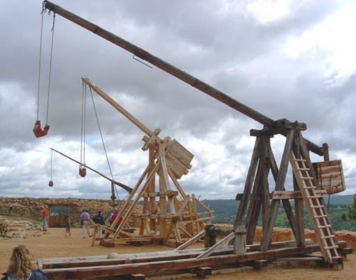

Introduction
============

Overview
--------

**pytrebuchet** is a Python package for simulating trebuchet mechanics using physics-based differential equations.
The package models the complete launch sequence from initial arm position through projectile release and ballistic
flight, enabling accurate prediction of projectile trajectories, release velocities, and throwing distances.

The simulation employs Lagrangian mechanics to derive the equations of motion and uses numerical integration (via
SciPy's ``solve_ivp``) to solve the resulting system of ordinary differential equations (ODEs).

What is a Trebuchet?
--------------------

A trebuchet is a type of medieval siege engine that uses a counterweight to launch projectiles over considerable distances.
Unlike catapults that rely on tension or torsion, trebuchets use gravitational potential energy stored in a heavy
counterweight to accelerate a projectile attached via a sling to the end of a rotating arm.

   Trebuchet siege engine. Credit: Luc Viatour / `CC BY-SA 3.0 <https://creativecommons.org/licenses/by-sa/3.0/>`_

Key components include:

* **Arm**: A beam that pivots around a fulcrum (axle)
* **Counterweight**: A heavy mass attached to the short end of the arm
* **Sling**: A flexible cord attached to the long end of the arm that holds the projectile
* **Projectile**: The object being launched
* **Frame**: The supporting structure (not modeled in simulations)

Supported Trebuchet Types
--------------------------

pytrebuchet supports two main trebuchet configurations:

`Hinged Counterweight Trebuchet <https://www.google.com/search?q=hinged+counterweight+trebuchet>`_
~~~~~~~~~~~~~~~~~~~~~~~~~~~~~~~~~~~~~~~~~~~~~~~~~~~~~~~~~~~~~~~~~~~~~~~~~~~~~~~~~~~~~~~~~~~~~~~~~~

The traditional design (pictured above) featuring a counterweight that hangs from the short end of the throwing arm
via a pivot point (and a sling, often).
The projectile typically rests on the ground or in a trough before launch.

`Whipper Trebuchet <https://www.google.com/search?q=whipper+trebuchet>`_
~~~~~~~~~~~~~~~~~~~~~~~~~~~~~~~~~~~~~~~~~~~~~~~~~~~~~~~~~~~~~~~~~~~~~~~~

A special variant where the counterweight hanger is positioned at the **top** of the throwing arm rather than hanging
down at its end.
This configuration creates a "whipping" motion during launch.
The arm is rotated to a near-vertical position before release, allowing the counterweight to fall from above the arm
pivot and providing more time for acceleration of the projectile.

Physics
-------

The differential equations governing trebuchet motion were derived using **Lagrangian mechanics**.
The original equations for hinged counterweight trebuchets were developed by E. Constans and A. Constans and published
at `benchtophybrid.com <http://www.benchtophybrid.com/TB/TB_Literature.html>`_.

The simulation process consists of two distinct phases:

**1. Sling Phase**

During this phase, the projectile remains in the sling while the trebuchet arm rotates.
The sling phase terminates when the projectile is released (typically when the projectile's velocity vector reaches the
desired launch angle).

**2. Ballistic Phase**

After release, the projectile follows a ballistic trajectory influenced by:

* Gravitational acceleration
* Aerodynamic drag (modeled using Reynolds number-dependent drag coefficients)
* Initial velocity and launch angle from the sling phase

The ballistic phase ends when the projectile impacts the ground.

Key Features
------------

pytrebuchet provides a comprehensive set of features for trebuchet analysis:

* **Multiple trebuchet types**: Support for both hinged counterweight and whipper configurations
* **Realistic physics**: Lagrangian mechanics-based equations of motion
* **Aerodynamic modeling**: Reynolds number-dependent drag coefficients using the Clift-Grace-Weber correlation,
  assuming spherical projectiles
* **Environmental factors**: Configurable air density, temperature, and gravitational acceleration
* **Customizable parameters**: Full control over arm dimensions, masses, inertias, sling properties, and more
* **Trajectory visualization**: Built-in plotting capabilities for position, velocity, and energy
* **Validated results**: The prediction of the projectile's trajectory by pytrebuchet of a hinged counterweight
  trebuchet has been verified by comparing it to the prediction made by
  `https://virtualtrebuchet.com/ <https://virtualtrebuchet.com/>`_ for the same input parameters.
